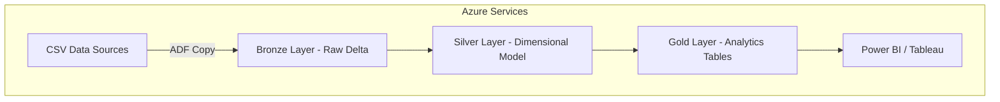
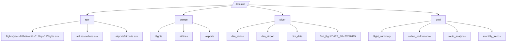
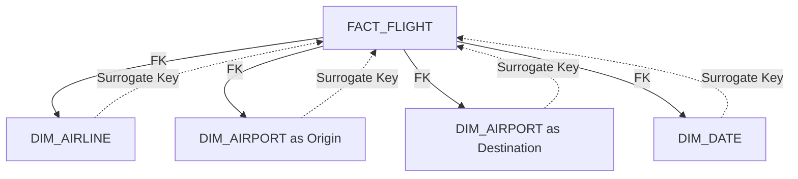

# Flight Data Medallion Architecture

A comprehensive data engineering solution for **flight analytics** using **Azure Data Factory (ADF)**, **Azure Databricks**, and **Azure Data Lake Storage (ADLS Gen2)**. The solution follows a **Medallion Architecture** with dimensional modeling, surrogate keys, and Delta Lake best practices.

## Table of Contents

- [Architecture Overview](#architecture-overview)
- [Prerequisites](#prerequisites)
- [Data Lake Structure](#data-lake-structure)
- [Data Model](#data-model)
- [Implementation Guide](#implementation-guide)
- [Code Examples](#code-examples)
- [Deployment](#deployment-strategy)
- [Deployment with Databricks Asset Bundles (DAB)](#deployment-with-databricks-asset-bundles-dab)
- [Monitoring](#monitoring--alerting)
- [FAQ](#faq)
- [Additional Resources](#additional-resources)
- [Contributing](#contributing)
- [License](#license)

---

## Architecture Overview

This solution implements a medallion architecture with three layers:

```
Data Sources → Bronze (Raw) → Silver (Dimensional) → Gold (Analytics) → BI Tools
     ↓             ↓              ↓                    ↓              ↓
   CSV Files → Delta Tables → Fact/Dim Tables → Aggregated Data → Power BI
```

The architecture uses a layered Medallion approach:



### Delta Lake Features

- **Time Travel**: Query historical versions of data
- **ACID Transactions**: Reliable updates and consistency
- **Schema Evolution**: Adapt to changing source structures
- **Optimize & Z-Order**: Faster queries

### Data Lineage & Governance

- **Unity Catalog**: Centralized governance and lineage
- **Delta Lake Transaction Logs**: Change auditing
- **Azure Purview**: Metadata discovery and classification

### Performance Optimization

- **Bronze**: No partitioning (preserve raw)
- **Silver**: Partition by `flight_date`
- **Gold**: Partition by business dimensions (e.g., airline, route, month)

### Security & Governance

- **Azure AD**: Role-based access control
- **Service Principal**: ADF ↔ Databricks authentication
- **Managed Identity**: Secure cross-resource access
- **Azure Key Vault**: Store secrets and credentials

### Technology Stack

- **Orchestration**: Azure Data Factory
- **Processing**: Azure Databricks (PySpark + Delta Lake)
- **Storage**: ADLS Gen2
- **BI / Analytics**: Power BI, Tableau

---

## Prerequisites

### Azure Resources

- Azure Data Factory
- Azure Databricks Workspace
- Azure Data Lake Storage Gen2
- Azure Key Vault (recommended)

### Permissions

- `Storage Blob Data Contributor` role on ADLS
- Databricks workspace access
- ADF pipeline execution rights

---

## Data Lake Structure



## Data Lake Structure

```
/datalake/
├── raw/                    # Bronze Layer - Raw CSV files
│   ├── flights/
│   │   └── year=2024/month=01/day=15/flights.csv
│   ├── airlines/
│   │   └── airlines.csv
│   └── airports/
│       └── airports.csv
├── bronze/                 # Bronze Layer - Delta format
│   ├── flights/
│   ├── airlines/
│   └── airports/
├── silver/                 # Silver Layer - Dimensional model
│   ├── dim_airline/
│   ├── dim_airport/
│   ├── dim_date/
│   └── fact_flight/
│       └── DATE_SK=20240115/
└── gold/                   # Gold Layer - Analytics ready
    ├── flight_summary/
    ├── airline_performance/
    ├── route_analytics/
    └── monthly_trends/
```

## Data Model

### Source Data Structure

- **Flights**: Fact table with flight details, delays, cancellations
- **Airlines**: Dimension with airline information
- **Airports**: Dimension with airport details and locations

### Dimensional Model (Silver Layer)

#### Fact Table

**FACT_FLIGHT**

```
FLIGHT_SK (PK)              -- Surrogate Key
DATE_SK (FK)                -- References DIM_DATE
AIRLINE_SK (FK)             -- References DIM_AIRLINE
ORIGIN_AIRPORT_SK (FK)      -- References DIM_AIRPORT
DESTINATION_AIRPORT_SK (FK) -- References DIM_AIRPORT
FLIGHT_NUMBER               -- Degenerate Dimension
TAIL_NUMBER                 -- Degenerate Dimension
DEPARTURE_DELAY             -- Measure
ARRIVAL_DELAY               -- Measure
DISTANCE                    -- Measure
... (other measures)
```

#### Dimension Tables

**DIM_AIRLINE**

```
AIRLINE_SK (PK)    -- Surrogate Key
IATA_CODE          -- Natural Key
AIRLINE            -- Airline Name
```

**DIM_AIRPORT**

```
AIRPORT_SK (PK)    -- Surrogate Key
IATA_CODE          -- Natural Key
AIRPORT            -- Airport Name
CITY, STATE, COUNTRY
LATITUDE, LONGITUDE
```

**DIM_DATE**

```
DATE_SK (PK)       -- Surrogate Key
FULL_DATE          -- Actual Date
YEAR, MONTH, DAY
DAY_OF_WEEK, QUARTER
IS_WEEKEND
```

---

## Data Model

### Silver Layer: Dimensional Model



## Implementation Guide

### Step 1: Bronze Layer Processing

**Purpose**: Ingest raw CSV → Delta tables

```python
# bronze_ingestion.py
df = spark.read.csv("/mnt/raw/flights/", header=True, inferSchema=True)
df.write.format("delta").mode("overwrite").save("/mnt/bronze/flights/")
```

### Step 2: Silver Layer Processing

**Purpose**: Create dimensions and fact tables with surrogate keys

```python
# silver_processing.py
from pyspark.sql.functions import monotonically_increasing_id

airlines = spark.read.format("delta").load("/mnt/bronze/airlines/")
airlines = airlines.withColumn("AIRLINE_SK", monotonically_increasing_id())
airlines.write.format("delta").mode("overwrite").save("/mnt/silver/dim_airline/")
```

### Step 3: Gold Layer Analytics

**Purpose**: Aggregated analytics tables

```python
# gold_analytics.py
fact_flight = spark.read.format("delta").load("/mnt/silver/fact_flight/")
summary = fact_flight.groupBy("AIRLINE_SK", "DATE_SK").agg(avg("ARRIVAL_DELAY"))
summary.write.format("delta").mode("overwrite").save("/mnt/gold/airline_performance/")
```

### Step 4: ADF Orchestration

Pipeline structure:

1. Copy Activity → Raw Layer
2. Databricks Notebook → Bronze
3. Databricks Notebook → Silver
4. Databricks Notebook → Gold
5. Data Validation

---

## Code Examples

    ### Data Quality Validation
    ### Incremental Processing Pattern

---

## Deployment Strategy

### Environment Setup

- **Development**: Feature development
- **Testing**: Integration / UAT
- **Production**: Live pipelines

```bash
# Resource Group
az group create --name rg-flight-data-dev --location eastus

# Deploy via ARM template
az deployment group create \
  --resource-group rg-flight-data-dev \
  --template-file infrastructure/main.json \
  --parameters @infrastructure/dev.parameters.json
```

### CI/CD Pipeline

- Azure DevOps or GitHub Actions
- Infrastructure as Code (ARM/Bicep/Terraform)
- Git version control for notebooks
- Automated data validation tests

---

## Deployment with Databricks Asset Bundles (DAB)

This project can be deployed using **Databricks Asset Bundles (DAB)**, which allows for reproducible, CI/CD-friendly deployment of Databricks resources (jobs, pipelines, clusters, notebooks, etc.).

### Prerequisites

0. Install **UV** (the Astral CLI):  
   https://docs.astral.sh/uv/getting-started/installation/

1. Install the **Databricks CLI**:  
   https://docs.databricks.com/dev-tools/cli/databricks-cli.html

2. Authenticate to your Databricks workspace:

   ```bash
   $ databricks configure

   ```

3. To deploy a development copy of this project, type:

   ```
   $ databricks bundle deploy --target dev
   ```

   (Note that "dev" is the default target, so the `--target` parameter
   is optional here.)

   This deploys everything that's defined for this project.
   For example, the default template would deploy a job called
   `[dev yourname] unicargo_dab_job` to your workspace.
   You can find that job by opening your workpace and clicking on **Workflows**.

4. Similarly, to deploy a production copy, type:

   ```
   $ databricks bundle deploy --target prod
   ```

   Note that the default job from the template has a schedule that runs every day
   (defined in resources/unicargo_dab.job.yml). The schedule
   is paused when deploying in development mode (see
   https://docs.databricks.com/dev-tools/bundles/deployment-modes.html).

5. To run a job or pipeline, use the "run" command:
   ```
   $ databricks bundle run
   ```
6. Optionally, install developer tools such as the Databricks extension for Visual Studio Code from
   https://docs.databricks.com/dev-tools/vscode-ext.html.

7. For documentation on the Databricks asset bundles format used
   for this project, and for CI/CD configuration, see
   https://docs.databricks.com/dev-tools/bundles/index.html.

## Monitoring & Alerting

### Key Metrics to Monitor

| Metric                | Threshold | Alert Level |
| --------------------- | --------- | ----------- |
| Pipeline Success Rate | < 95%     | Critical    |
| Data Freshness        | > 4 hours | Warning     |
| Row Count Variance    | > 20%     | Warning     |
| Processing Time       | > 2 hours | Warning     |

### Azure Monitor Queries

```kusto
// Pipeline failure rate
AzureDiagnostics
| where ResourceProvider == "MICROSOFT.DATAFACTORY"
| where Status == "Failed"
| summarize FailureCount = count() by bin(TimeGenerated, 1h)
| render timechart

// Data processing volume trends
customEvents
| where name == "DataProcessed"
| extend RowCount = todouble(customMeasurements.RowCount)
| summarize avg(RowCount) by bin(timestamp, 1d)
| render timechart
```

### Data Quality Dashboard

Use Power BI to track:

- Daily volumes
- Processing SLAs
- Null/error rates
- Data lineage health

---

### Alert Conditions

Pipeline failures
Data quality threshold breaches
Unexpected data volume changes
Processing time anomalies

## FAQ

### Q: Why use surrogate keys instead of natural keys?

**A**: Surrogate keys provide:

- Better performance (integer joins vs string joins)
- Stability when business keys change
- Support for slowly changing dimensions
- Reduced storage in fact tables

### Q: How do you handle late-arriving data?

**A**:

- Use Delta Lake's MERGE operations for upserts
- Implement date-based partitioning for efficient updates
- Set up monitoring for data arrival patterns

### Q: What's the difference between Bronze, Silver, and Gold?

**A**:

- **Bronze**: Raw data as-is, minimal processing
- **Silver**: Clean, validated, dimensional model
- **Gold**: Business-ready, aggregated analytics tables

### Q: How do you ensure data quality?

**A**:

- Automated validation checks at each layer
- Schema enforcement with Delta Lake
- Data profiling and anomaly detection
- Comprehensive logging and monitoring

### Q: How to handle schema evolution?

**A**:

- Use Delta Lake's schema evolution features
- Version control for schema changes
- Backward compatibility testing
- Gradual rollout of schema updates

### Q: What about real-time processing?

**A**: This architecture focuses on batch processing. For real-time:

- Add Azure Event Hubs for streaming ingestion
- Use Databricks Structured Streaming
- Implement lambda architecture pattern

---

## Additional Resources

- [Delta Lake Docs](https://docs.delta.io/)
- [Azure Databricks Best Practices](https://learn.microsoft.com/azure/databricks/)
- [ADF Patterns](https://learn.microsoft.com/azure/data-factory/)
- [Dimensional Modeling Guide](https://www.kimballgroup.com/)

## Contributing

1. Fork the repository
2. Create a feature branch
3. Make your changes
4. Add tests and documentation
5. Submit a pull request

## License

This project is licensed under the MIT License - see the [LICENSE](LICENSE) file for details.
